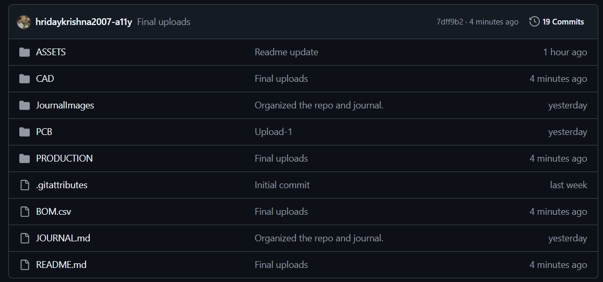
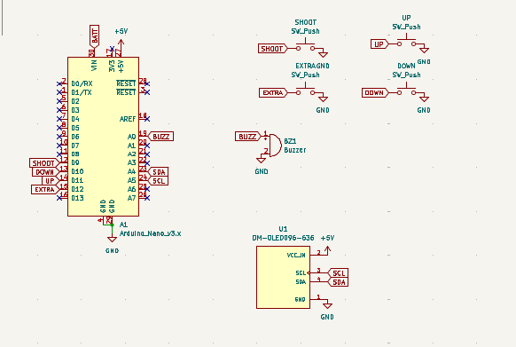
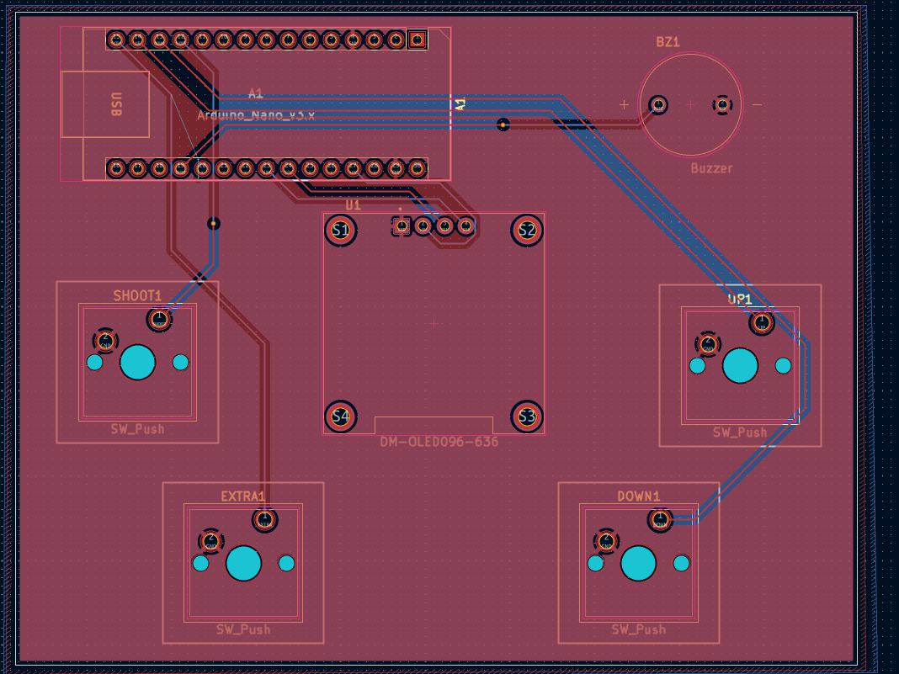
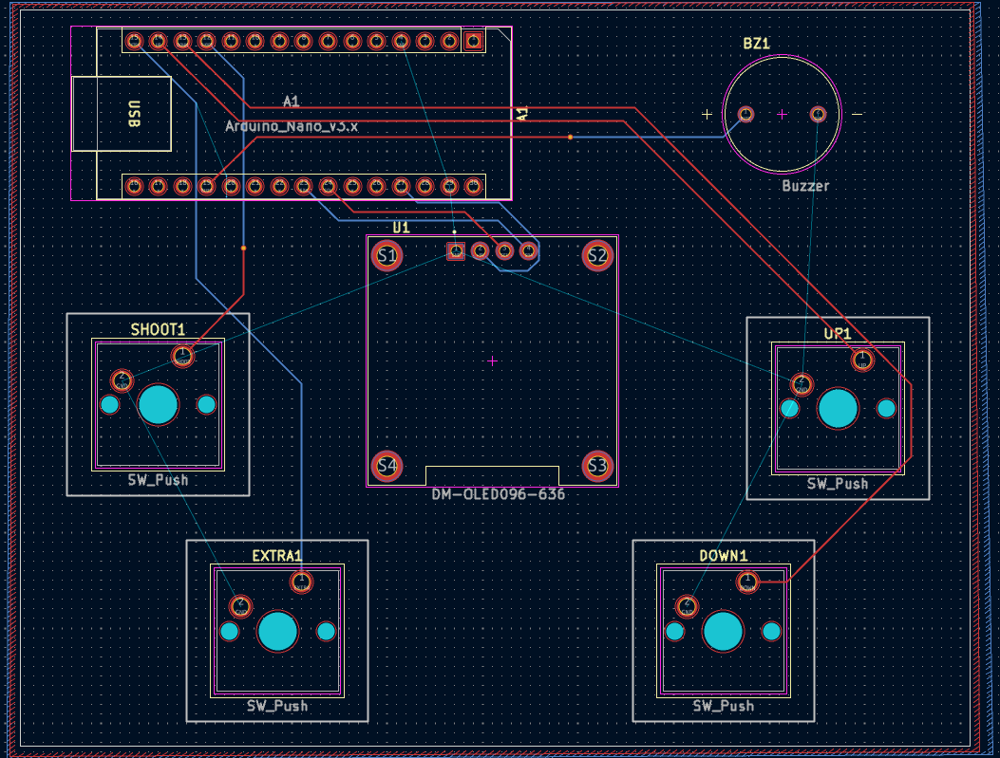

# Mini-Game-Console
## Day-1: tested the circuit on wokwi and made schematics [13th Jul, 2026; 7:01 pm] [J-1]
- Tested and troubleshooted the circuit and logic on wokwi. due to a breadboard error i made,I got confused lol

- made the schematics on kicad. Added extra control buttons so that the console could be used with manyyy games.

Recordings:
https://lapse.hackclub.com/timelapse/9d2t55453Uiu
https://lapse.hackclub.com/timelapse/nDKRG0l3SooJ
https://lapse.hackclub.com/timelapse/hTYw8-52Bi8z
https://lapse.hackclub.com/timelapse/-t1wMTPBpjFD
Time taken: 191 minutes : 3 hr 11 min

## Day-2: Finished working on the pcb [14th Jul, 2026; 2:15 pm]
- Downloaded and imported the footprints of the components i am using in the project
- Decided to drop using the battery and use usb power because it got heave and defeated the purpose of this being portable.

Recordings:
https://lapse.hackclub.com/timelapse/oJeSY94ifWu1
https://lapse.hackclub.com/timelapse/bdBB9f8efjW5
Time taken: 85 min : 1 hr 25 min