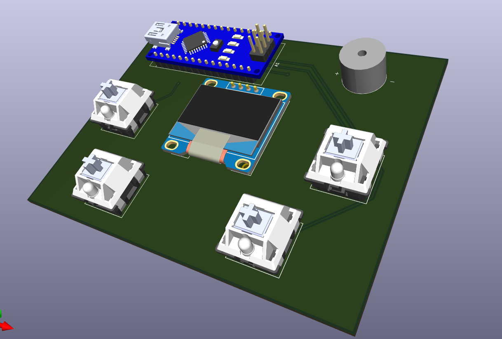
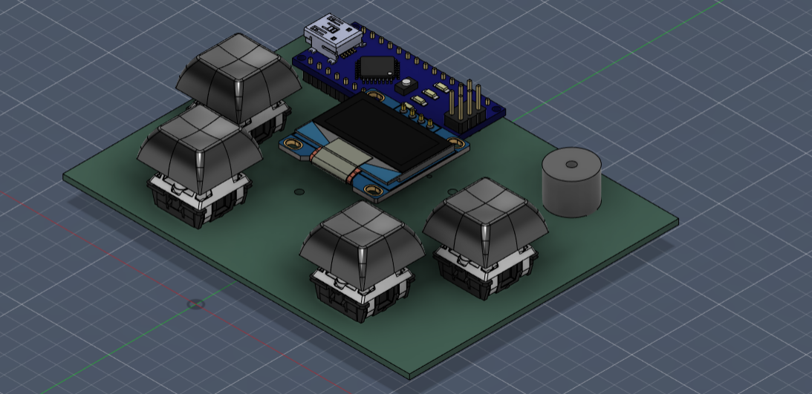
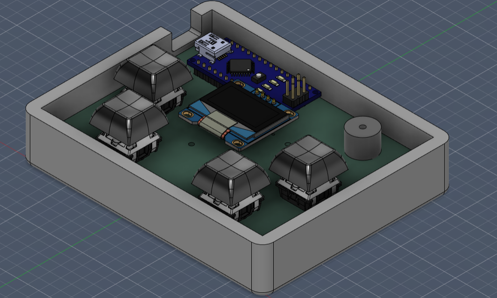
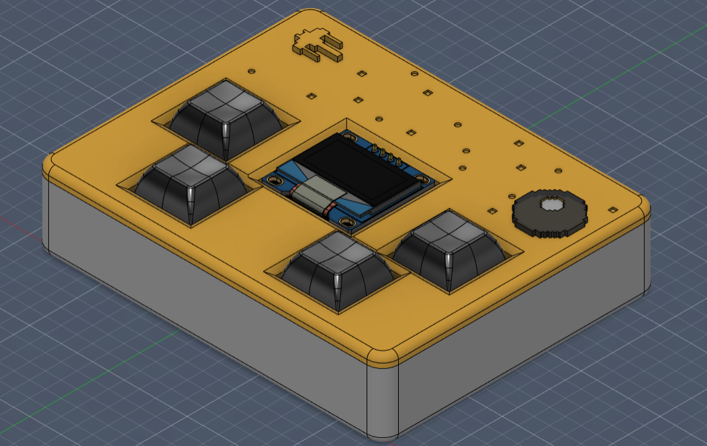
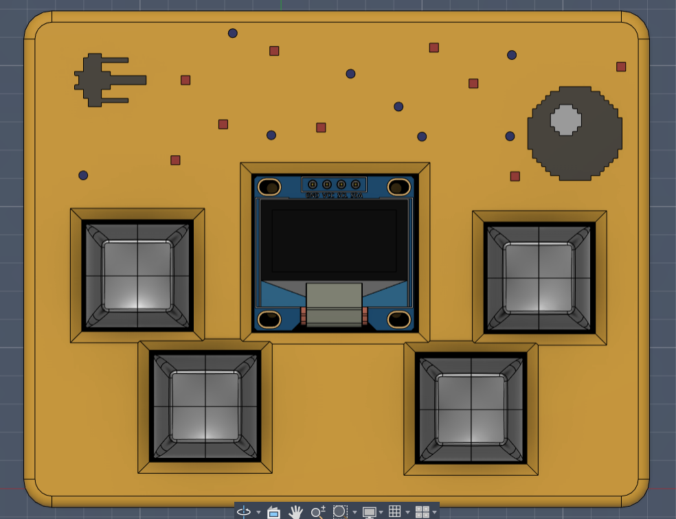
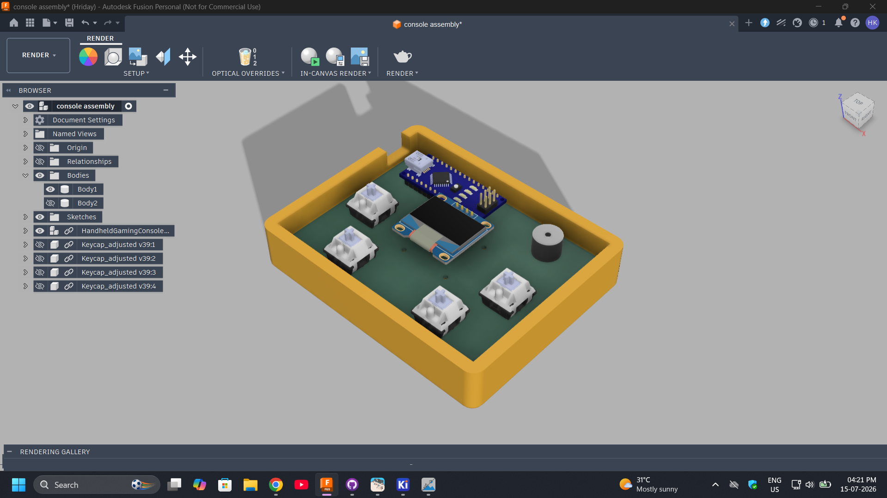
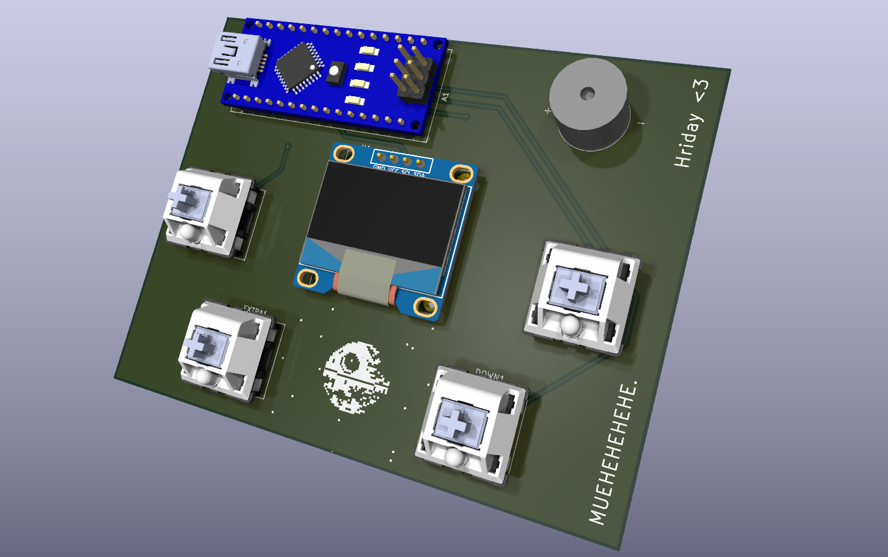

# Mini-Game-Console
## Journal-1: tested the circuit on wokwi and made schematics [13th Jul, 2026; 7:01 pm] [J-1]
- IMP NOTE: I am slow at typing T-T 
- Tested and troubleshooted the circuit and logic on wokwi. due to a breadboard error i made,I got confused lol

- made the schematics on kicad. Added extra control buttons so that the console could be used with manyyy games.

Recordings:
1. https://lapse.hackclub.com/timelapse/9d2t55453Uiu
2. https://lapse.hackclub.com/timelapse/nDKRG0l3SooJ
3. https://lapse.hackclub.com/timelapse/hTYw8-52Bi8z
4. https://lapse.hackclub.com/timelapse/-t1wMTPBpjFD
Time taken: 191 minutes : 3 hr 11 min

## Journal-2: Finished working on the pcb [14th Jul, 2026; 2:15 pm]
- Downloaded and imported the footprints of the components i am using in the project
- Decided to drop using the battery and use usb power because it got heave and defeated the purpose of this being portable.

Recordings:
5. https://lapse.hackclub.com/timelapse/oJeSY94ifWu1
6. https://lapse.hackclub.com/timelapse/bdBB9f8efjW5
Time taken: 85 min : 1 hr 25 min.

## Journal-3: assigned the 3d models and made the case. [15th Jul, 2026; 3:00 pm]
- downloaded the  3d .step model of the components and assigned them to the respective footprints.

- Learnt and exported the 3d model of the pcb assembly to fusion to build a case around it.

- designed the case around the pcb assembly

- made some art on the case to make it look special <3
- now assigning colours to it! [learnt how to do that on YT]
- made a few .svg files to help me assist in extruding the deathstar and the X-Wing.
- added som squares and circles as the projectiles shot by the spacecrafts.

- I still have some colour assigning to do lol.

Timelapses:
7. https://lapse.hackclub.com/timelapse/M0RD4-lXABkA
8. https://lapse.hackclub.com/timelapse/JNOY_ep9VuGy
9. https://lapse.hackclub.com/timelapse/km-6RsCr_r-d
10. https://lapse.hackclub.com/timelapse/JjaPQTsMu-mx
11. https://lapse.hackclub.com/timelapse/WApxHjhJyl0f
Total Time taken: 134 min; 2 hr 14 min
total time at hackatime atp: 7 hr 40 min 

## Journal-4: Art, Pcb final Iterations, Documentation [15th Jul, 2026; 4:35 pm]
- completed the art. thought that id use some realizm in the coulour of the laser projectiles used in the deathstar and the X-wing but it didnt look good so i let it be blue and red.

- took screenshots for progress and documentatioan

- added some silkscreen art on the pcb cuz i thought it looked a little boring.

