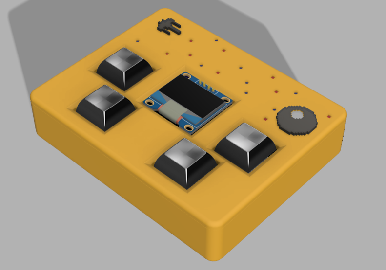
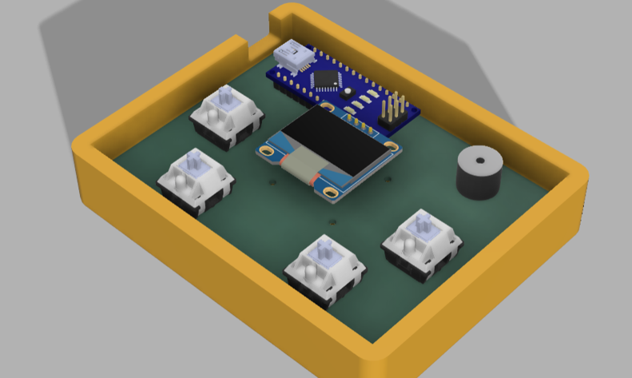
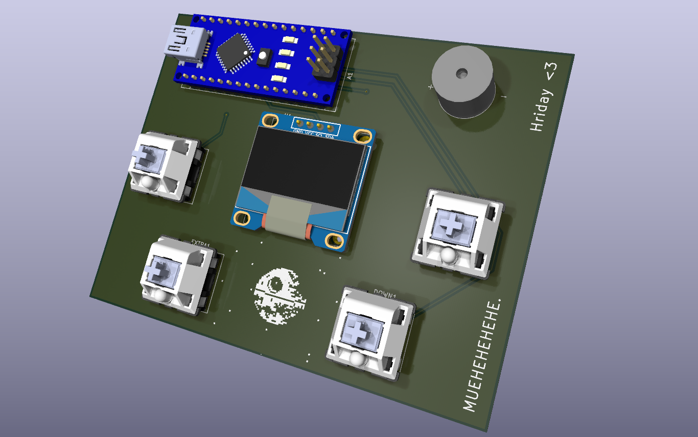
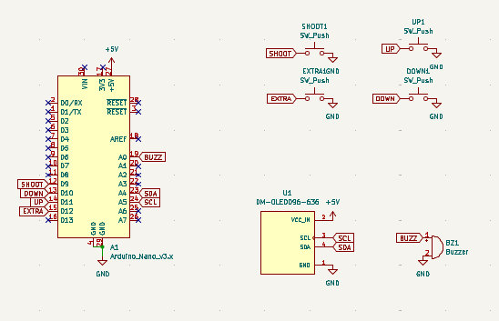

# Mini-Game-Console

## ***Small handheld game console, it runs on an arduino nano!***
This small DIY console is designed to make teens learn how to build real hardware projects, play games and teach them how to code.  
It runs on an arduino nano and takes power from a usb power source. It has 4 Mechanical CherryMX keyboard switches as the controller buttons. and a 128x64 OLED display!  

## ***PCB Design & Assembly***
  

This is a 2 layer PCB with dimentions of 99.40x77.02 mm.  

**PCB FILES HERE:** [Link](https://github.com/hridaykrishna2007-a11y/Mini-Game-Console/tree/main/PCB)

## ***Schematics***  
  

## ***PCB Design***
.png)  

## Why it was made?
This Project was made for Horizons arcana in singapore ! ( THANK YOU HACK CLUB <3 )

## HOW TO BUILD THIS PROJECT:  
Easy Peasy.
- Order the parts from the BOM and get the case and the keycaps 3d printed and ready.
- Solder the parts on the pcb and keep the orientations in mind (or you are cooked).
- Superglue the case together. (This project is designed keeping portablity and light weight in mind. Hence no screws as it will increase the weight)
- Purchase or 3d print some keycaps (here's one: https://www.printables.com/model/118708-simple-cherry-mx-keycap)
- upload your code (or the sample one in this same repo) using usb cable and arduino ide.
- connec to a power source like a powerbank.
- PLAYYYYYYYY!!!!!!

https://github.com/user-attachments/assets/bd86371d-4319-4f34-b711-88d048939bdb

